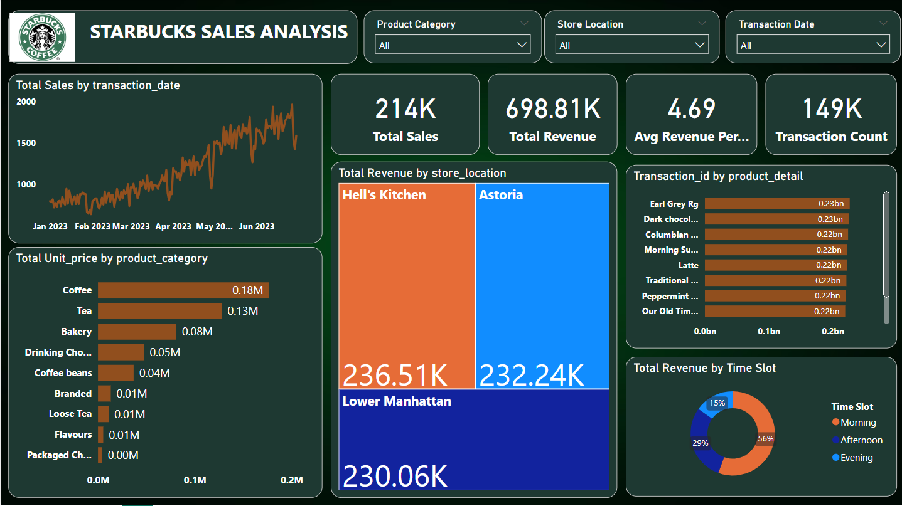

# ☕ Starbucks Sales Analysis Dashboard

This Power BI dashboard provides a comprehensive analysis of Starbucks sales data, helping uncover key trends in product performance, revenue by store location, and customer behavior across time slots.

---

## 📊 Dashboard Overview

The dashboard offers interactive visualizations and KPIs to explore:

- 📈 Total Sales Trends by Date  
- 🏪 Revenue by Store Location  
- 🛍️ Product Category & Unit Price  
- 🧾 Top-Selling Product Details  
- 🕒 Revenue Distribution by Time Slot  
- 📋 Key Metrics: Total Sales, Revenue, Transactions, and Avg. Revenue per Transaction  

---

## 🧠 Key Insights

- **Total Sales**: 214K | **Total Revenue**: 698.81K | **Transactions**: 149K
- **Hell’s Kitchen** store generated the **highest revenue** (236.51K), followed closely by **Astoria** and **Lower Manhattan**.
- **Morning Time Slot** accounted for **56% of total revenue**, making it the **peak period for sales**.
- **Coffee and Tea** are the top categories by unit price, contributing significantly to revenue.
- Products like **Earl Grey Rg**, **Latte**, and **Columbian Brew** are among the **best sellers**.

---

## 📌 Where Can This Dashboard Be Used?

- **Retail Store Management** – to monitor daily/weekly sales and identify peak business hours.
- **Marketing & Promotions** – to focus efforts on best-selling products and high-traffic time slots.
- **Inventory Planning** – to align stock with demand based on category and location performance.
- **Regional Strategy** – for comparing store-level success across locations like Hell’s Kitchen, Astoria, etc.

---

## 🛠️ Tools & Technologies Used

- **Power BI Desktop**
- Data Transformation using **Power Query**
- Interactive Filters: Product Category, Store Location, Transaction Date
- DAX Measures for KPIs (e.g., Avg. Revenue per Transaction)

---

## 📷 Dashboard Screenshot

> *(Replace with your actual image file name in the repo)*

---

## 📥 How to Use

1. Clone or download the repository.
2. Open the `.pbix` file in **Power BI Desktop**.
3. Interact with filters to explore the data from different perspectives.

---

## ✍️ Author

**Kajal Kewat**  
Feel free to connect or provide feedback!

---

## ⭐ Support

If you found this project helpful, please ⭐ star the repo and share it with others!

